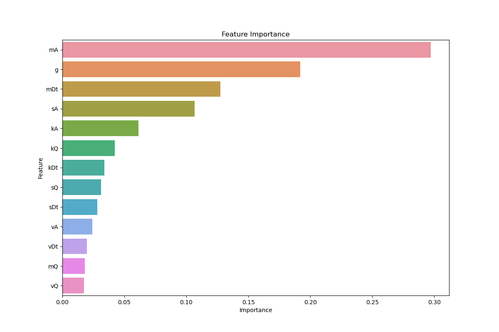

# Detecting Adversarial DNS Tunneling Attacks Using Machine Learning

**Author: Neel Aiyar**

## Executive summary
This project aims to develop and evaluate machine learning models for detecting adversarial DNS tunneling attacks. By leveraging a dataset of DNS traffic,
the project seeks to identify the most relevant features and model configurations that contribute to high detection accuracy, ultimately enhancing network
security measures against these covert attacks.

## Rationale
Understanding the effectiveness of machine learning models in identifying malicious activities within DNS tunneling traffic is paramount for bolstering 
cybersecurity measures. Without such insight, organizations risk leaving themselves vulnerable to undetected threats, potentially resulting in compromised 
data integrity and service outages. By delving into the factors that influence model performance and shedding light on feature significance, this research 
aims to inform the development of more robust detection systems, thereby fortifying critical data and infrastructure against cyber threats.

## Research Question
How do different sets of features impact the ability of machine learning models to detect malicious DNS tunneling attacks?

## Data Sources
The dataset used in this project is from Kaggle and can be found at https://www.kaggle.com/datasets/cnrieiit/adversarial-machine-learning-dataset/data 

## Methodology
**Data Collection and Preprocessing:** The dataset consists of DNS tunneling traffic, with both legitimate and malicious examples, including adversarial attacks generated using different methods (CW, FGSM, JSMA).Data is loaded from CSV files and concatenated into a single DataFrame.

**Feature Engineering:** Features related to DNS traffic, such as mean, variance, and skewness of various attributes, are used to train the models.

**Model Selection:** Two machine learning models are used: Logistic Regression and Random Forest Classifier.

**Cross-Validation:** Cross-validation is applied to evaluate model performance on the training set.

**Hyperparameter Tuning:** Randomized Search CV is used to tune hyperparameters for the Random Forest model to improve performance.

**Model Evaluation:** Accuracy, confusion matrices, and classification reports are used to evaluate the models. Feature importance from the Random Forest model is visualized to identify which features contribute most to the model's predictions.

**Visualization:** Plotly, Matplotlib, and Seaborn were used to create visualizations of cross-validation scores, confusion matrices, and feature importance.

## Results
**Model Performance:**
   - **Logistic Regression:**
     - Accuracy: 86.5%
     - The model struggled with detecting legitimate traffic (class 0), achieving 0 precision, recall, and F1-score for this class.

   - **Random Forest Classifier:**
     - Accuracy: 86.5%
     - The model also struggled with detecting legitimate traffic but showed slightly better performance in detecting malicious traffic (class 1).

**Feature Importance:**

   - The Random Forest model highlighted the most important features contributing to model predictions:
     - `mA`: Mean of attribute A (Importance: 0.147)
     - `mDt`: Mean of attribute Dt (Importance: 0.102)
     - `sA`: Skewness of attribute A (Importance: 0.099)
     - `kA`: Kurtosis of attribute A (Importance: 0.091)
     - Other features like `mQ`, `sQ`, `vQ`, etc., also contributed significantly.

**Evaluation Metrics:**
   - Accuracy was the primary evaluation metric, but the models' confusion matrices and classification reports indicated that the models were biased towards detecting malicious traffic and had difficulty detecting legitimate traffic.

## Next steps
To enhance the model's performance, particularly in accurately detecting legitimate DNS tunneling traffic, several strategies can be implemented. First, addressing class imbalance by implementing techniques like SMOTE (Synthetic Minority Over-sampling Technique) can balance the classes in the training dataset. Exploring additional features or transformations could also help improve model performance, especially for detecting legitimate traffic. Experimenting with a more complex model such as neural networks might better capture the nuances in the data. Using methods that combine multiple models may leverage their strengths and improve overall performance. Conducting a thorough error analysis to understand why the models misclassify legitimate traffic can help address specific issues. Validating the models on real-time DNS traffic data is crucial to assess their performance in a live environment and make necessary adjustments. Lastly, exploring and implementing adversarial training or other defense mechanisms can make the models more robust against adversarial attacks, ensuring better detection and resilience.

## Outline of project

- [Link to Python Notebook](http://localhost:8891/notebooks/Desktop/Academic/BerkPG/Capstone/Adversarial.ipynb)
- [Link to Dataset](https://www.kaggle.com/datasets/cnrieiit/adversarial-machine-learning-dataset/data)
